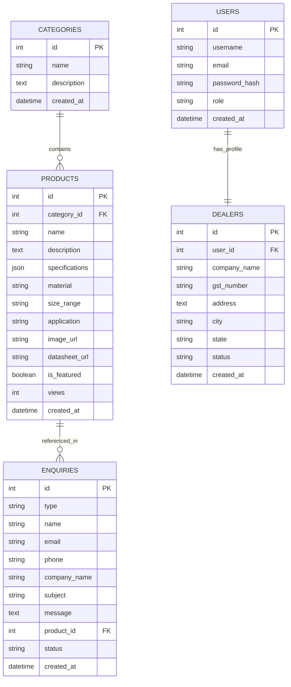

# Entity Relationship Diagram

```mermaid
erDiagram
    CATEGORIES ||--o{ PRODUCTS : contains
    PRODUCTS ||--o{ ENQUIRIES : referenced_in
    USERS ||--|| DEALERS : has_profile
    
    CATEGORIES {
        int id PK
        string name
        text description
        datetime created_at
    }
    
    PRODUCTS {
        int id PK
        int category_id FK
        string name
        text description
        json specifications
        string material
        string size_range
        string application
        string image_url
        string datasheet_url
        boolean is_featured
        int views
        datetime created_at
    }
    
    USERS {
        int id PK
        string username
        string email
        string password_hash
        string role
        datetime created_at
    }
    
    ENQUIRIES {
        int id PK
        string type
        string name
        string email
        string phone
        string company_name
        string subject
        text message
        int product_id FK
        string status
        datetime created_at
    }
    
    DEALERS {
        int id PK
        int user_id FK
        string company_name
        string gst_number
        text address
        string city
        string state
        string status
        datetime created_at
    }
```
